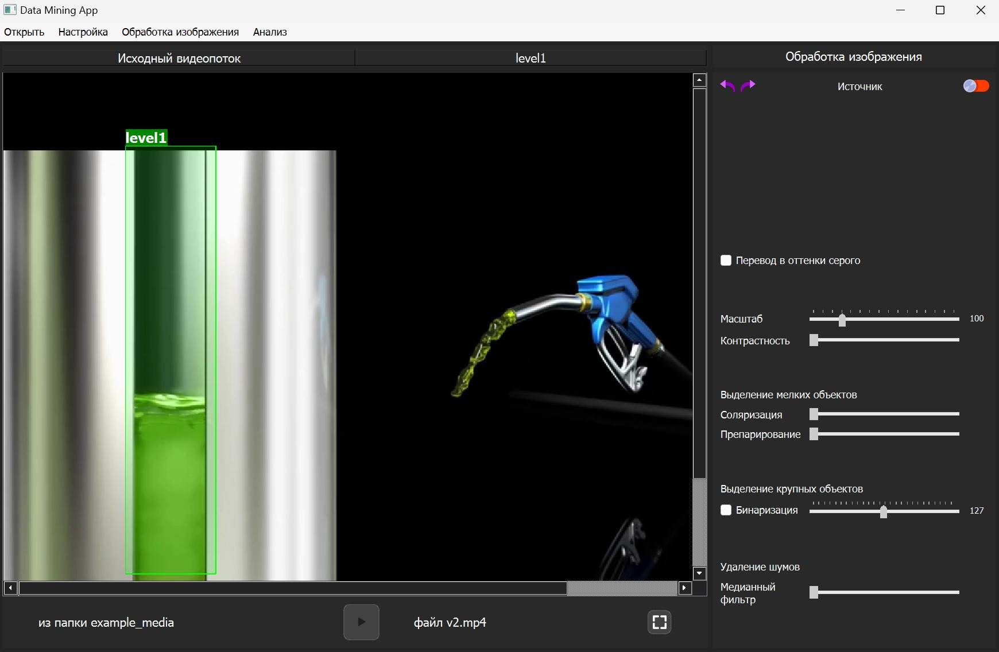

# Python videoplayer

<a name="readme-top"></a>

<!-- PROJECT LOGO -->
<br />
<div align="center">
  <a href="https://github.com/lostie21yo/python-desktop-videoplayer">
    
  </a>
</div>

<!-- TABLE OF CONTENTS -->
<details>
  <summary>Table of Contents</summary>
  <ol>
    <li>
      <a href="#about-the-project">About The Project</a>
      <ul>
        <li><a href="#built-with">Built With</a></li>
      </ul>
    </li>
    <li>
      <a href="#getting-started">Getting Started</a>
      <ul>
        <li><a href="#installation">Installation</a></li>
      </ul>
    </li>
    <li><a href="#usage">Usage</a></li>
    <li><a href="#contact">Contact</a></li>
  </ol>
</details>


<!-- ABOUT THE PROJECT -->
## About The Project

This is a program, which allow you to open images, videos and camera stream with some extra functionality (bounding boxes, cutting and etc.)

<!-- Demo video on YouTube [here](https://www.youtube.com/watch?v=4na8KFVoyZM&list=PL4lVqWiqXeK15HICGgnRiJTThgfftHEyt&index=5) -->

<!-- <p align="right">(<a href="#readme-top">back to top</a>)</p> -->


### Built With

* Python 3.10
* PyQT6
* OpenCV

<!-- <p align="right">(<a href="#readme-top">back to top</a>)</p> -->


<!-- GETTING STARTED -->
## Getting Started

<!-- ### Prerequisites -->

### Installation

1. Clone the repo
   ```sh
   git clone https://github.com/lostie21yo/funeral-app2
   ```
2. With Python installed run app.py

<!-- You can also open an already running application using [Vercel](https://) -->
<!-- <p align="right">(<a href="#readme-top">back to top</a>)</p> -->


<!-- USAGE EXAMPLES -->
## Usage

1. You can open different type of media (images, videos and camera stream)
2. You can select an area on the image with the cursor
3. You can process image by using binarization, convertation to shades of gray etc.

<div align="center">
    
</div>


<!-- <p align="right">(<a href="#readme-top">back to top</a>)</p> -->


<!-- CONTACT -->
## Contact

Ilya K - [Telegram](https://t.me/leoncox) - leon.coxsw@gmail.com

Project Link: [Python videoplayer](https://github.com/lostie21yo/python-desktop-videoplayer)

<p align="right">(<a href="#readme-top">back to top</a>)</p>

<div align="center">
© 2023 GitHub, Inc.
</div>
